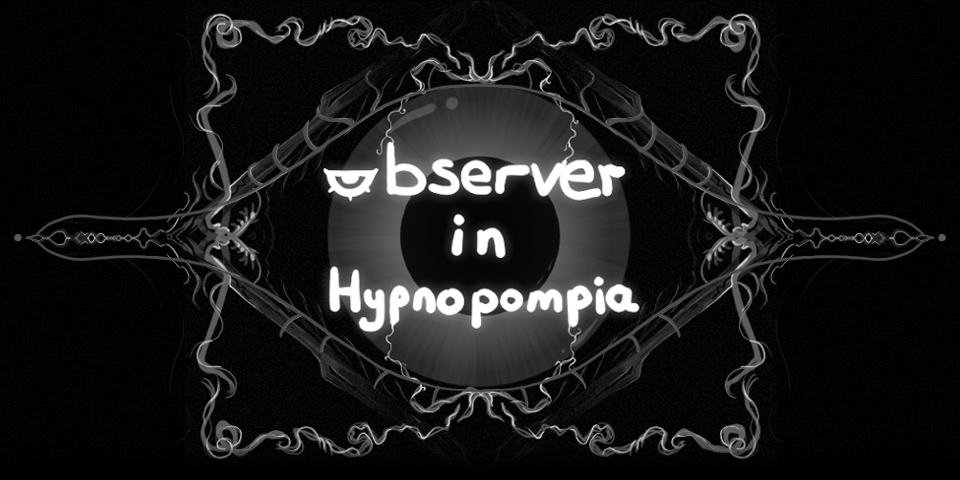

# Yusuf 'EakyRtk'
##  About Me

I'm Yusuf 'EakyRtk', game developer and artist. Currently making a strategic rogue-like deck builder. I'm always looking forward to learn new stuff and make different things. I love open-source community and currently active in Godot Turkiye community, teaching interested people about the Godot Engine ^^

## My Stuff
### Games
[My games chilling in itch.io](https://eakyrtk.itch.io/)

The games I'm proud of their site design, would be happy if you check it out!

[Observer in Hypnopompia](https://eakyrtk.itch.io/observer-in-hypnopompia)

### Art

## Currently Learning
- Doing shaders in Godot
- Doing plugins for Godot
- PixiJS

## Hardware & Software
- **My System:** Linux (CachyOS), RTX3080, RAM 16GB, i5-12400F
- **Engine:** Godot 4.5
- **Editors:** VSCode, ZED

## Contact
- **Discord:** eakyrtk
- **E-mail:** EakyLeRtk@proton.me
