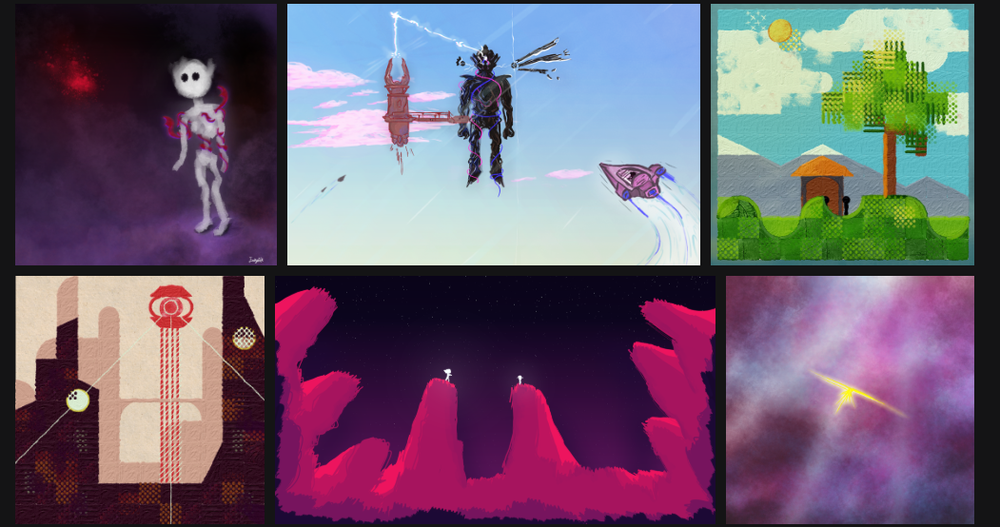

# Yo, I'm Yusuf 'EakyRtk'
## *A b o u t   M e*

Game developer and artist. Currently making a strategic rogue-like deck builder with a team. I'm always looking forward to learn new stuff and make different things. I love open-source softwares and so we found Godot Turkiye community for Turkish people to interact and learn the Godot Engine ^^

##       *M y   S t u f f*
### 🎮 *[My games chilling in itch.io](https://eakyrtk.itch.io/)*

I recommend checking my games not only for the games but I also design custom CSS on my itch.io pages!

    
### 🖌️ *[Some of my art resting on my website](https://eakyrtk.com/my-art/)*

## 📚 Currently Learning
- Doing shaders in Godot
- Doing plugins for Godot
- PixiJS

## 💻 Hardware & Software
- **My System:** Linux (CachyOS), RTX3080, RAM 16GB, i5-12400F
- **Engine:** Godot 4.5
- **Editors:** VSCode, ZED
- **Vim Btw**

## 📬 Contact
- **Discord:** eakyrtk
- **E-mail:** EakyLeRtk@proton.me
